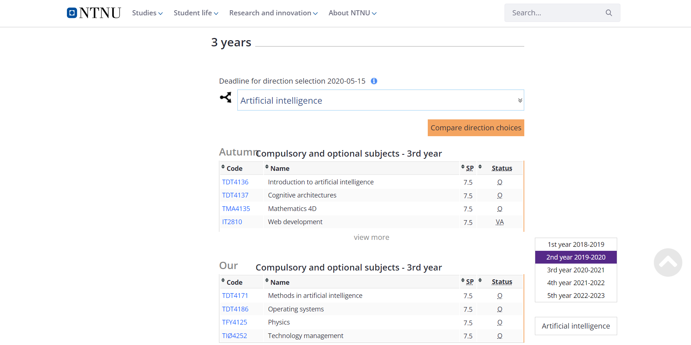

# TDT4250_Assignement_GJ

## Members of the project
Guillermo García-Nalda Noval,
Javier Fernández Rozas

## Website chosen
[Link](https://www.ntnu.no/studier/mtdt/studieretninger-og-hovedprofiler#year=2019&programmeCode=MTDT&dir=MTDTKI-19)

Screenshots:

## Assignement 2
## SETUP
1)Clone repository

2)Open Eclipse

3)"File" -> "Open Projects from file System..." and open all projects except "Second/B"

4)Select TDT4250.Assignement1.GJ AND Run as Eclipse Aplication (This will generate another eclispe)

5)Import Existing projects into workspace, and you import the folder Second (project B)

6)Make sure to have dependencies/plugins installed

7)In this project, we go to the folder src/B.main, and we have the .mtl with the transformations

8)We finde the model in src/model (same as assignement 1, just changed some typos of the instance). We copied it into B to be easier to access

9)To run the mtl, we just open it, and select run as "Launch Acceleo Aplications", which will create the html files in the folder output (Ignore the error of 2 files with same name). Notice that the folder to open is the first one (1Computer technology - master's degree (5-year).html). The rest of the htmls are links to each course page. There also comes a css file in the output folder to make the page more readable.

## Project description
We have transformed the .xmi to a webpage to show the information, through acceleo on a .mtl file.
We used an M2T transformation.

## This is from assignement 1
## SETUP
1)Clone repository

2)Open Eclipse

3)"File" -> "Open Projects from file System..."

4)Select the folder

5)Make sure to have dependencies/plugins installed

## Project description
We have modelled an instance of the 5 year Computer technology - master's degree, being the Artificial Intelligence the chosen field

We created different classes and atributes to describe the website, as the shown in the following model

We used 2 Enums to cover fields such as the course status (compulsory or elective) or the semester (spring or autumn)

We created 3 constraints (CreditNumber, MaxNumberCredits and MaxYear), 2 manually and 1 OCL

## .ECORE

## .XMI with instance loaded

## .UML Partial view

## Extra features created

-Tests

-Loader of data from .xmi files

